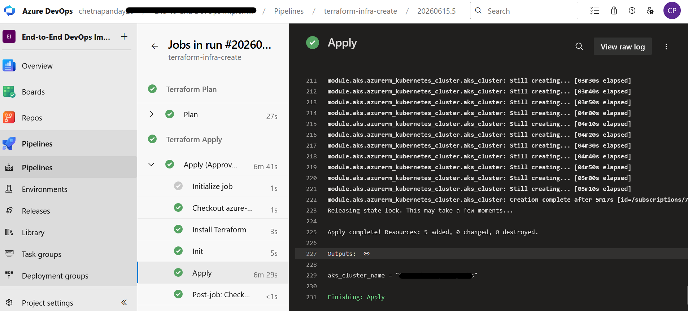
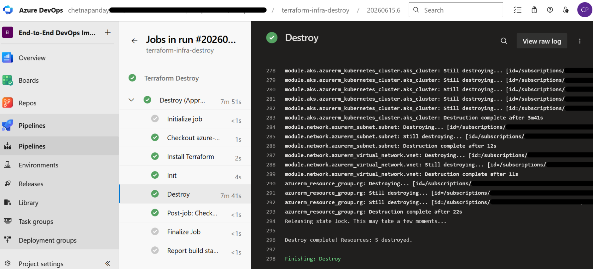
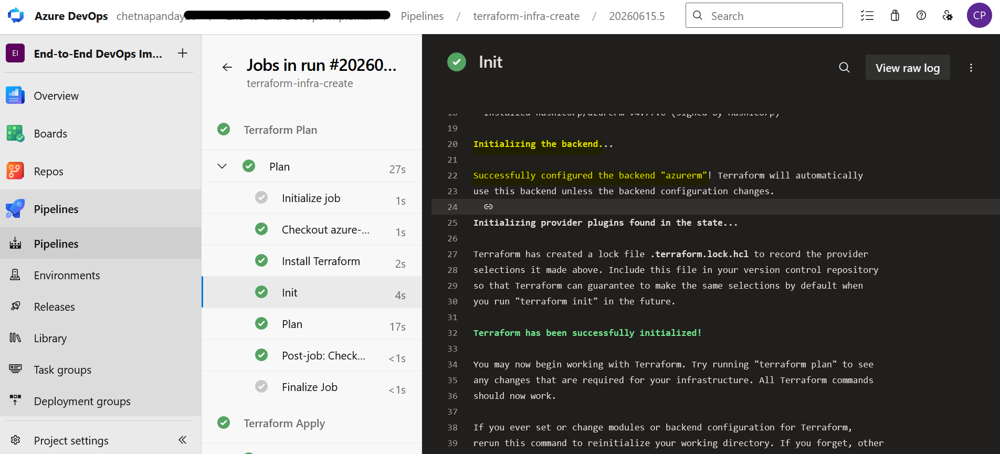

# AKS Infrastructure — Terraform + Azure DevOps

Terraform code to provision AKS, ACR and networking on Azure (for use with [voting-app-aks-argocd](https://github.com/Chetna-DevOps/voting-app-aks-argocd) and related projects), deployed via Azure DevOps pipelines.
Infrastructure provisioned 

## What Gets Created

- Resource Group
- Virtual Network + Subnet
- Azure Container Registry (ACR)
- AKS Cluster (attached to the VNet)

## Structure

```
terraform/
├── main.tf                  # calls all modules
├── variables.tf
├── outputs.tf
├── tf/
│   └── test.tfvars          # environment-specific values
└── modules/
    ├── aks/                 # AKS cluster configuration
    ├── container_registry/  # ACR configuration
    └── virtual_network/     # VNet + Subnet configuration
```

## Pipelines

Two pipelines — Plan/Apply and Destroy:

- **Plan** runs automatically, **Apply** requires manual approval before infrastructure is created
- **Destroy** also requires manual approval to prevent accidental deletion
- Terraform state is stored remotely in Azure Blob Storage so it's shared across pipeline runs

## Setup

- Create a storage account in Azure for Terraform state
- Create variable group `terraform-project-variables` in Azure DevOps Library with: `azurerm_service_connection`, `ResourceGroupName`, `StorageAccountName`, `ContainerName`, `Key`
- Replace placeholders in `tf/test.tfvars` with your actual resource names

## Usage

```bash
terraform init
terraform plan -var-file="tf/test.tfvars"
terraform apply -var-file="tf/test.tfvars"
```

## What I Did

- Wrote Terraform modules for AKS, ACR and VNet — each resource in its own module for reusability
- Configured remote backend using Azure Blob Storage for shared state management
- Set up Azure DevOps pipelines with approval gates on Apply and Destroy to prevent accidental changes
- Used `.tfvars` for environment-specific values so the same code can be reused for different environments

## Pipeline Runs

#### Infra Creation Pipeline



#### Infra Deletion Pipeline



#### Azure Storage Backend Configured


